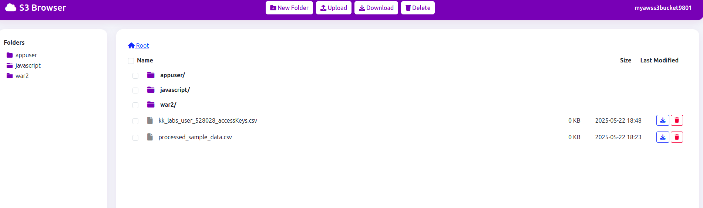

# S3 File Manager



A modern web application built with Flask to manage your AWS S3 buckets. This application allows you to:
- Browse and switch between multiple S3 buckets
- View files and folders in your S3 buckets
- Upload files to your buckets
- Download files from your buckets
- Delete files from your buckets
- Create new folders in your buckets

## Setup

1. Clone this repository
2. Install the required dependencies:
   ```bash
   pip install -r requirements.txt
   ```

3. Create a `.env` file in the root directory with your AWS credentials:
   ```
   AWS_ACCESS_KEY_ID=your_access_key_here
   AWS_SECRET_ACCESS_KEY=your_secret_key_here
   AWS_REGION=your_region_here
   ```

4. Run the application:

   For development:
   ```bash
   python app.py
   ```

   For production (using Gunicorn):
   ```bash
   gunicorn --bind 0.0.0.0:8000 --workers 4 --timeout 120 --access-logfile - --error-logfile - wsgi:app
   ```

5. Open your browser and navigate to:
   - Development: `http://localhost:5000`
   - Production: `http://localhost:8000`

## Gunicorn Configuration

The application is configured to run with Gunicorn using the following settings:
- Binds to all network interfaces (0.0.0.0)
- Runs on port 8000
- Uses 4 worker processes
- Sets a timeout of 120 seconds for long-running requests

You can customize these settings by modifying the Gunicorn command:
```bash
gunicorn --bind 0.0.0.0:8000 --workers 4 --timeout 120 --access-logfile - --error-logfile - wsgi:app
```

Additional Gunicorn options:
- `--workers`: Number of worker processes (recommended: 2-4 × number_of_cores)
- `--timeout`: Worker timeout in seconds
- `--access-logfile`: Access log file location
- `--error-logfile`: Error log file location
- `--daemon`: Run in background
- `--pid`: PID file location

## Features

- Modern, responsive UI built with Bootstrap 5
- Multi-bucket support with easy switching
- Real-time file operations
- Flash messages for operation feedback
- File size display
- Confirmation dialogs for destructive actions
- Auto-dismissing notifications
- File preview support for various file types

## Security Notes

- Never commit your `.env` file to version control
- Ensure your AWS credentials have the minimum required permissions
- The application uses secure file handling practices
- All file operations are performed through secure AWS SDK methods

## Requirements

- Python 3.7+
- Flask
- boto3
- python-dotenv
- gunicorn
- An AWS account with S3 access 